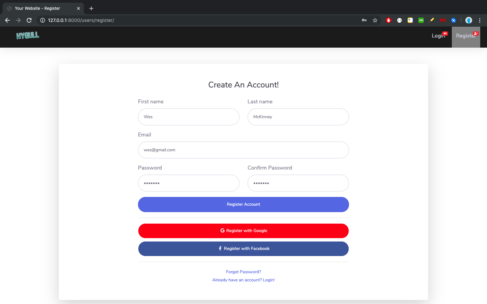
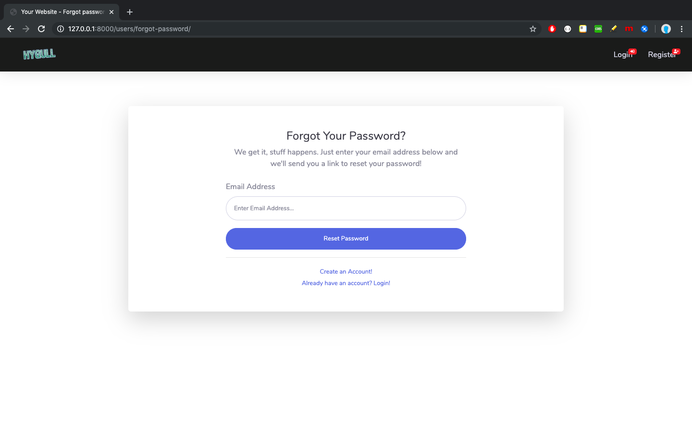
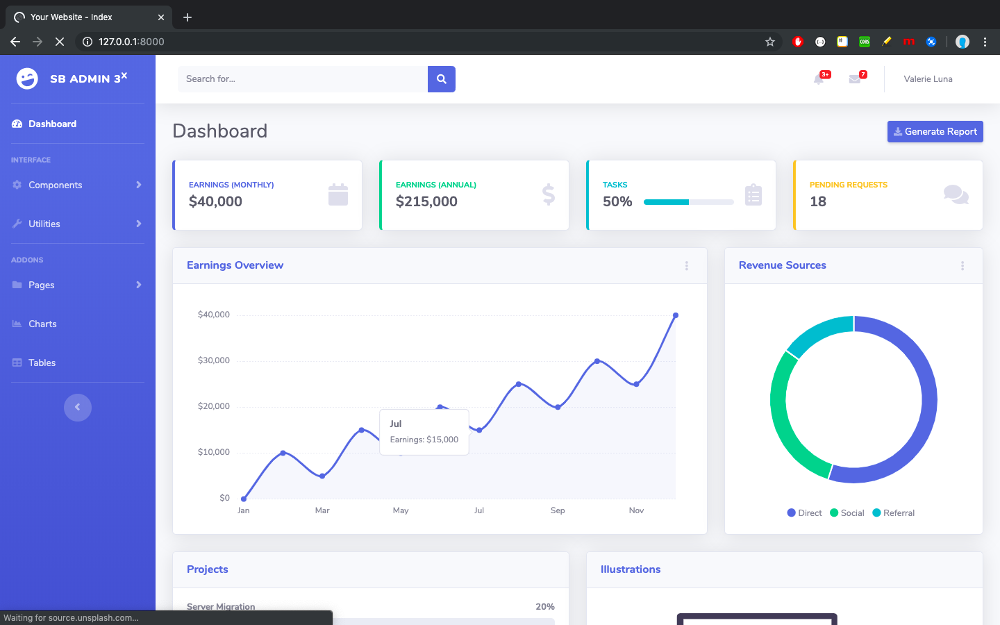
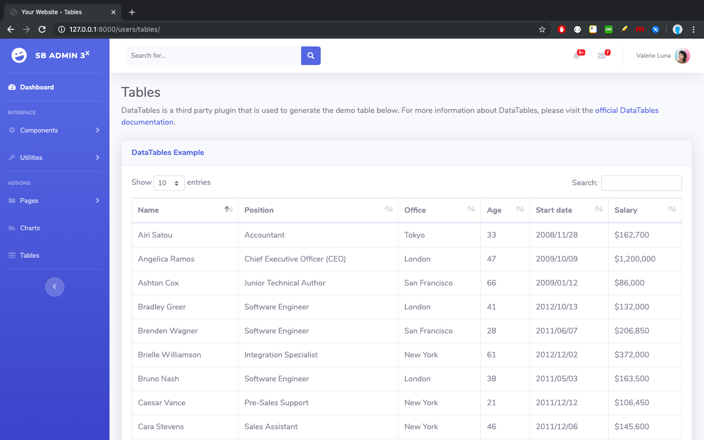
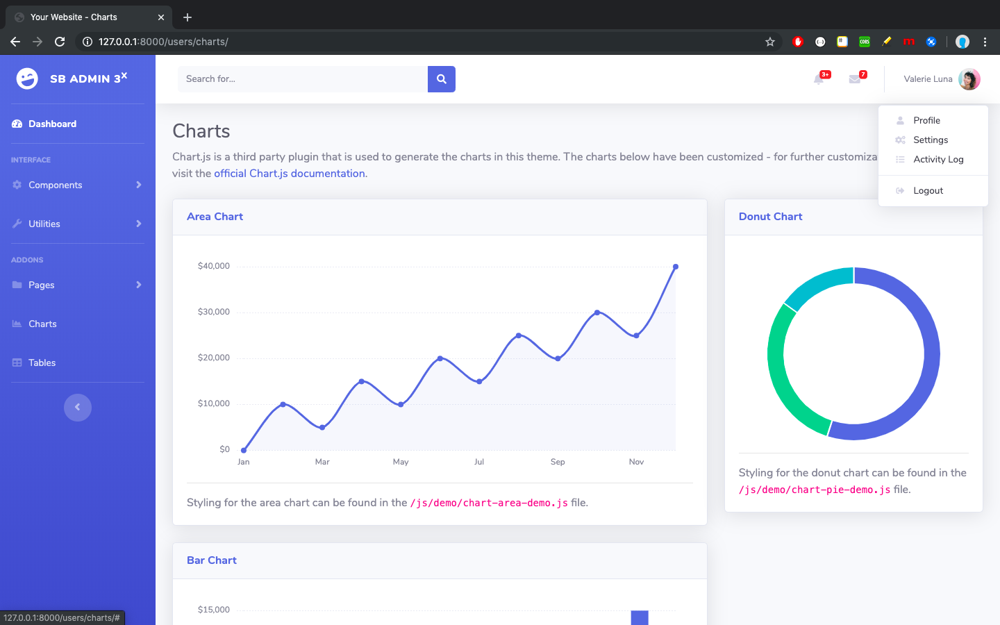

# sbadmin (SB Admin 2, Django project with all pages integrated)

Any of the following best fits to describe this project.

+ A Django project with full integration of free Admin template named [Sb Admin 2](https://startbootstrap.com/themes/sb-admin-2/).

+ A Django powered fully functional responsive bootstrapped template integration for Admin.

+ A full integration of free Admin template available at [https://startbootstrap.com/themes/sb-admin-2/](https://startbootstrap.com/themes/sb-admin-2/) and named as [Sb Amdin 2](https://startbootstrap.com/themes/sb-admin-2/).

## Table of contents

+ [Tech stack](#tech-stack)
+ [Features](#features)
+ [Templates & static files directories](#template-and-static-files-directories)
+ [How to run?](#how-to-run)

<h2 id="tech-stack">Tech stack</h2>

| Language/Framework | Version | End | 
| --- | --- | --- |
| Python | 3.6.7 | Backend |
| Django | 2.2.6 | Backend, Python's high level web framework |
| Bootstrap | 4 | Frontend, CSS framework |

<h2 id="features">Features</h2>

+ Django templating langauge (DTL) is used for template code re-structuring.
+ Redundant code has been removed from [Sb Admin 2](https://startbootstrap.com/themes/sb-admin-2/) template pages.
+ UI code is completely separate from backend code i.e. in [src/ui](src/ui).
+ Urls defined in all pages are fully dynamic so changing url in **urls.py** will not force you to make change in templates. Just one change is enough. 
+ Almost all urls can be found at [src/users/urls.py](src/users/urls.py) which starts with `/users/`.
+ Only the urls related to **Django admin site** (starts with `/admin/`) and **Index page** (`/`) is defined at [src/sbadmin/urls.py](src/sbadmin/urls.py).
+ Views are defined at [src/users/views.py](src/users/views.py) , [src/sbadmin/views.py](src/sbadmin/views.py).
+ Theme related code is separate from user implemented code. Also user can add his own template & static files separately.
+ Navbar has been for login/register/forgot_passord pages (These 3 extends the same base_x.html).

<h2 id="template-and-static-files-directories">Templates & static files directories</h2>

+ Templates (HTML files) are under [src/ui/templates](src/ui/templates).

+ All static files (JS, css, scss, images etc.) are under [src/ui/static/files](src/ui/static/files), which is further sub divided in 2 directories.
	+ **theme** which is [src/ui/static/files/theme](src/ui/static/files/theme) holds all static files related to [Sb Admin 2](https://startbootstrap.com/themes/sb-admin-2/) theme.
	+ **app/resource** which is [src/ui/static/files/app/resource](src/ui/static/files/app/resource) holds all static files created by developer. Under this, you can manage your files under **css**, **js**, **img**, **logos** directories. 

	> **Note:** Here the main intention of creating **resource** inside **app** directory is to get rid of conflicts when Django searchs for static files after looking into **STATICFILES_DIRS** setting variable's values (i.e. paths which points to directories where Django looks for static  files) in order & there are 2 files with same name in 2 different **js**/**css**/**img** etc. directories.

<h2 id="how-to-run">How to run?</h2>

Make sure you have 

+ Python3+ installed in your system
+ **virtualenv** Python package is installed (It will allow you to run **virtualenv** command to create virtual environment)

Now, just follow the below steps to run this project. 

+ **`git clone https://github.com/hygull/sbadmin.git`**
+ **`virtualenv venv`** OR `python3 -m virtualenv venv`  OR `python3.6 -m virtualenv venv` etc.
+ **`source venv/bin/activate`** on Linux/MAC OS X, **`.\venv\Scripts\activate`** on Windows
+ **`cd sbadmin`**
+ **`pip install -r requirements.txt`**
+ **`cd src`**
+ **`python manage.py migrate`**
+ **`python manage.py runserver`**

Now, visit [http://127.0.0.1:8000](http://127.0.0.1:8000) and play. Later, you can write your own views and implement the functionality.

<h2 id="screenshots">Screenshots</h2>

Here are few scrennshots related to the integrated theme.

> ### Register

> ### Login

> ### Forgot Password

> ### Dashboard

> ### Tables

> ### Colors & Notifications

> ### Charts

Thanks for going through the documentation.
